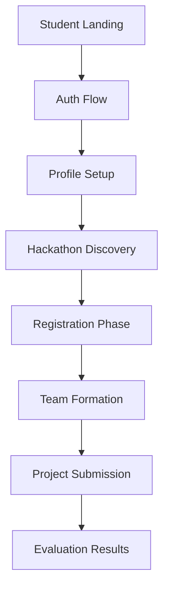

# 🎓 CodeCraft Student Portal


The **CodeCraft Student Portal** is the primary interface for hackathon participants. Built on Next.js with Tailwind CSS 4, it offers a seamless onboarding experience, real-time submission tracking, and a unified participant profile.

---

## 🛠️ Tech Stack

- **Framework**: Next.js (App Router architecture)
- **State Management**: Zustand (via `hackathonStore.ts`)
- **Styling**: Tailwind CSS 4 (Modern utility-first CSS)
- **Infrastructure**: Firebase Client & Admin SDK
- **Observability**: Vercel Analytics & Speed Insights

---

## 📂 Repository Structure

| Path | Purpose |
| :--- | :--- |
| `src/app/` | Next.js App Router (Pages, Layouts, API Routes) |
| `src/app/(protected)/` | Authenticated participant views |
| `src/components/` | Modular UI components (Layout, UI, Phases) |
| `src/store/` | Global state management via Zustand |
| `src/lib/` | Shared utilities and Firebase configuration |
| `src/types/` | TypeScript interface definitions |

---

## 🔄 Way of Working (Logic Flow)



---

## 🚀 Getting Started

1. **Install Dependencies**:

   ```bash
   npm install
   ```

2. **Run Dev Server**:

   ```bash
   npm run dev
   ```

3. **Production Build**:

   ```bash
   npm run build
   ```
