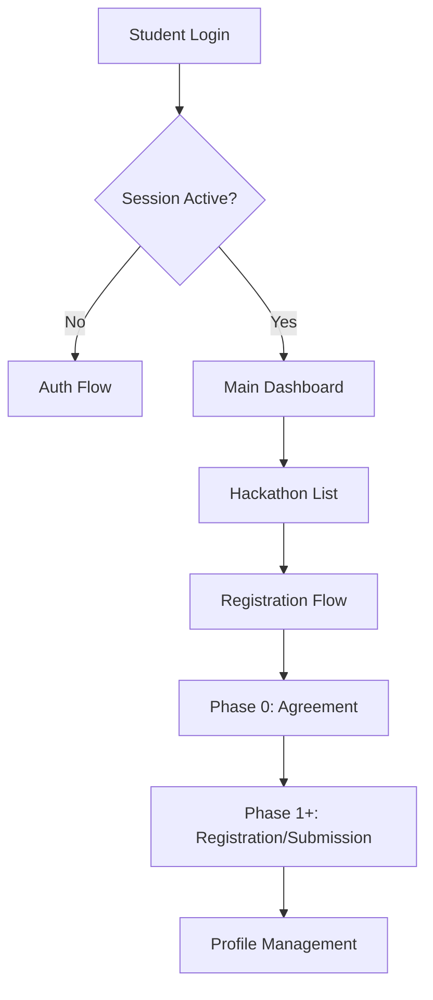

# 🎓 CodeCraft Student Dashboard

The immersive participant experience for CodeCraft. Built with Next.js 15, this dashboard provides a sleek, high-tech interface for hackathon registration, progress tracking, and team collaboration.


---

## 📂 Project Structure

| Path | Description |
| :--- | :--- |
| `src/app/` | Next.js App Router (Auth & Protected groups). |
| `src/components/` | Core UI components (Cyber-UI aesthetic). |
| `src/context/` | Global state providers (Auth, Theme). |
| `src/hooks/` | Custom React hooks for data fetching and logic. |
| `src/lib/` | Firebase configuration and API utilities. |
| `src/store/` | Client-side state management. |
| `src/types/` | TypeScript definitions and interfaces. |

---

## 🛠️ Way of Working (Logic Flow)



---

## ⚡ Quick Start

1. **Install Dependencies**

   ```bash
   npm install
   ```

2. **Run Development Server**

   ```bash
   npm run dev
   ```

3. **Production Build**

   ```bash
   npm run build
   ```

---

## 🌟 Visual Excellence

- **Cyber-UI Aesthetic**: Procedural animations, glassmorphism, and neon accents.
- **Dynamic Routing**: Instant navigation between hackathons and phases.
- **Responsive Design**: Optimized for both desktop and mobile participation.
- **Real-time Feedback**: Instant validation and submission status updates.
